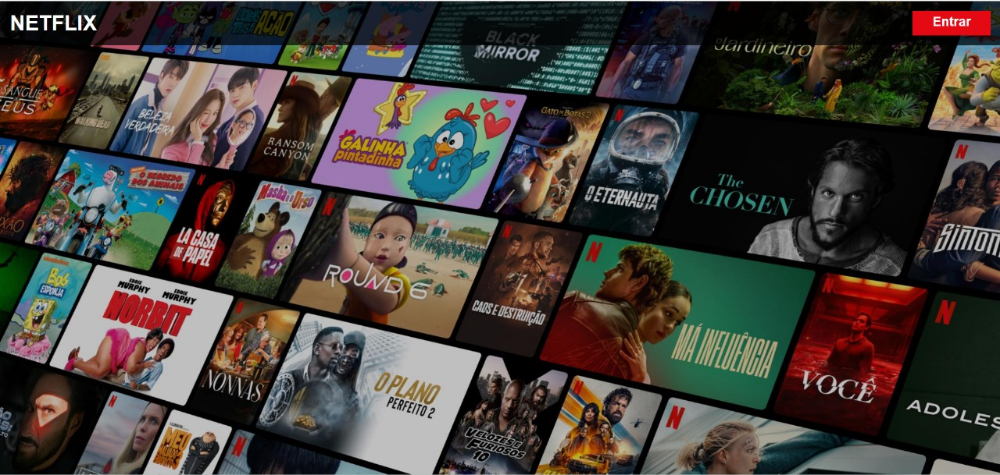

# 🎬 BeginningCSS-HTML

## 📌 Descrição
Primeiro exercício utilizando **HTML** e **CSS**.  
O objetivo foi recriar a **página inicial da Netflix**, focando no **menu superior** e na **imagem de fundo**, sem incluir a parte de login.

> Este projeto foi feito com o CSS embutido diretamente no arquivo HTML, utilizando apenas um único arquivo: `index.html`.

---

## 🛠️ Tecnologias utilizadas
- HTML5
- CSS3 (inline no HTML)

---

## 📸 Preview

---

## 🚀 Como executar

acesse o site:
https://wellingthonschuh.github.io/BeginningCSS-HTML/

ou:
git clone https://github.com/WellingthonSchuh/BeginningCSS-HTML.git
Abra o arquivo `index.html` no navegador.

---

## 📚 Aprendizados
- Estrutura básica de um documento HTML  
- Uso de CSS inline  
- Posicionamento de elementos com flexbox  
- Aplicação de imagem de fundo com background-image  

---

## 👨‍💻 Autor
Feito por **Wellingthon Schuh**  
🔗 [LinkedIn](https://www.linkedin.com/in/wellingthonschuh)
